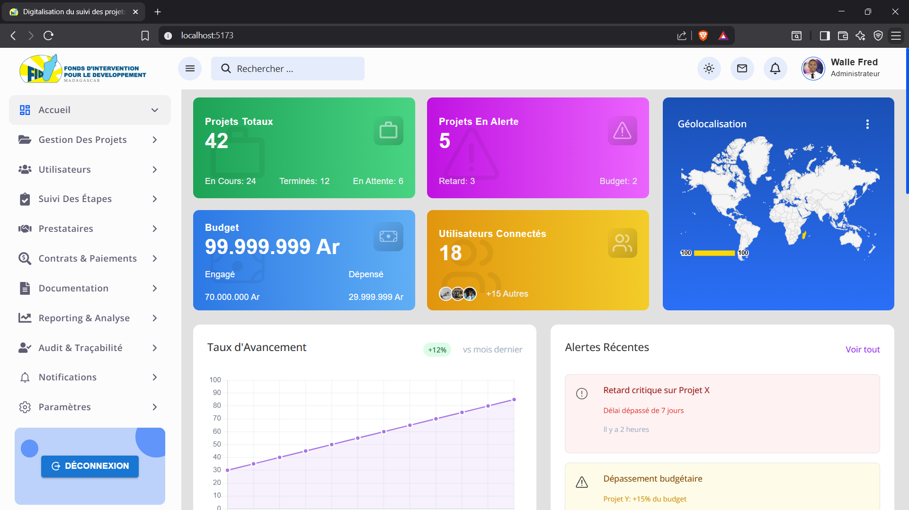
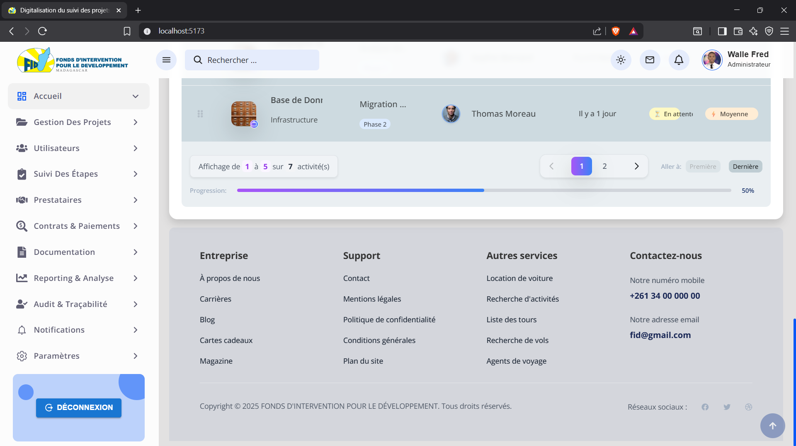

# React + TypeScript + Vite

GESTION EDT ET SALLE DE CLASSE est une application web full-stack permettant de gérer les emplois du temps et les réservations de salles de classe dans un établissement.
Le frontend est développé avec React, le backend avec Express.js, et la conception UML a été réalisée avec Visual Paradigm.
L'application permet d'éviter les conflits d'horaires, d'attribuer les salles de manière optimale, et de visualiser facilement l'organisation des cours.

## IMAGE POUR LA PAGE D'ADMINISTRATION .

